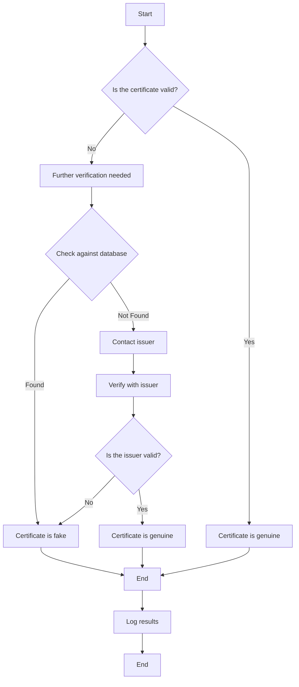

```mermaid
    graph TD;
        A[Start] --> B{Is the certificate valid?};
        B -- Yes --> C[Certificate is genuine];
        B -- No --> D[Further verification needed];
        D --> E{Check against database};
        E -- Found --> F[Certificate is fake];
        E -- Not Found --> G[Contact issuer];
        G --> H[Verify with issuer];
        H --> I{Is the issuer valid?};
        I -- Yes --> J[Certificate is genuine];
        I -- No --> F;
        F --> K[End];
        J --> K;
        C --> K;
        K --> L[Log results];
        L --> M[End];
```